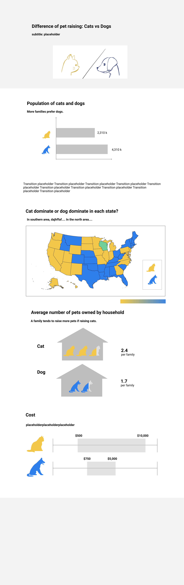
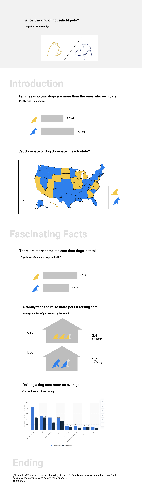

## Final Project
In the final project, I will write a story about fun facts behind pet raising statistics in the U.S.. People usually see dogs are more welcomed. However, there're more domestic cats in the U.S.. I will figure out the reason through data.
What's the cost and satisfaction behind these decisions. 
### Project Outline
* Introduction
Chart1: number of families that own pets 
Chart2: cat/dog dominating states
* Fascinating facts
Chart3: number of domestic pets 
Chart4: number of dogs/cats raised per household
* Ending

### Tool
* Storytelling & final deliverable: shorthand
* Data Visualization: Tableau, Infogram
* Graphic Design: Adobe Illustrator, Figma, etc

### Data Source
* [Dog vs Cats from Kaggle](https://www.kaggle.com/c/dogs-vs-cats)
* [Estimated annual expenses for dog and cat owners in the U.S. 2019 from Statista](https://www.statista.com/statistics/250851/basic-annual-expenses-for-dog-and-cat-owners-in-the-us/)
* [Pet Ownership Costs Guide for 2020](https://www.thesimpledollar.com/save-money/pet-cost-calculator/)

### User Testing Protocol
**Activity:** Since the information is still incomplete, I will go through the prototype and let viewer to provide feedback.
**Questions:**
1. What's the topic of this story? What do you think of the cohesion and clarity?
2. Does the charts answered the question at the beginning?
3. What confused you? Anything can be improved?
4. Other suggestions or comments?
Since I didn't have a clear structure at the beginning, I didn't ask the first and the second questions. Instead, I told viewers my ideas about the potential topics. Later after I finished two reviews, I revised the protocol to the current version.

### Prototype & User Research Feedback
**Version 1**
 
 Feedback
 * The map diagram is confusing due to multiple colors without explanation.
 * The map diagram doesn't make sense to people. I don't know why it needs to be here.
 * For the third chart, would be better if adjust the cat image to a smaller size, which can indicate the difference of body size between cats and dogs.
 * The charts are beautiful but lack of theme.
**Version 2**
 
 
 ### To-do-Next
 * Continuing on revising the story:
Conduct more tests on the storyline 
Revise and condense contents
 * Implement charts in Tableau and Infogram
 * Write story in Shorthand
