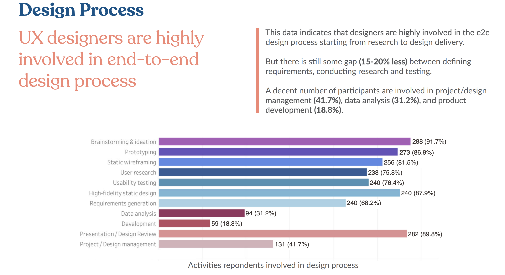
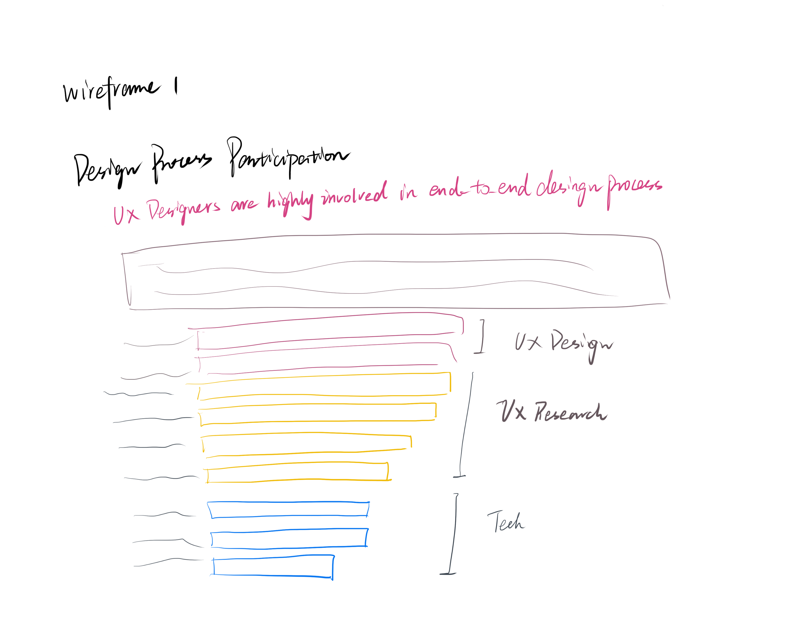
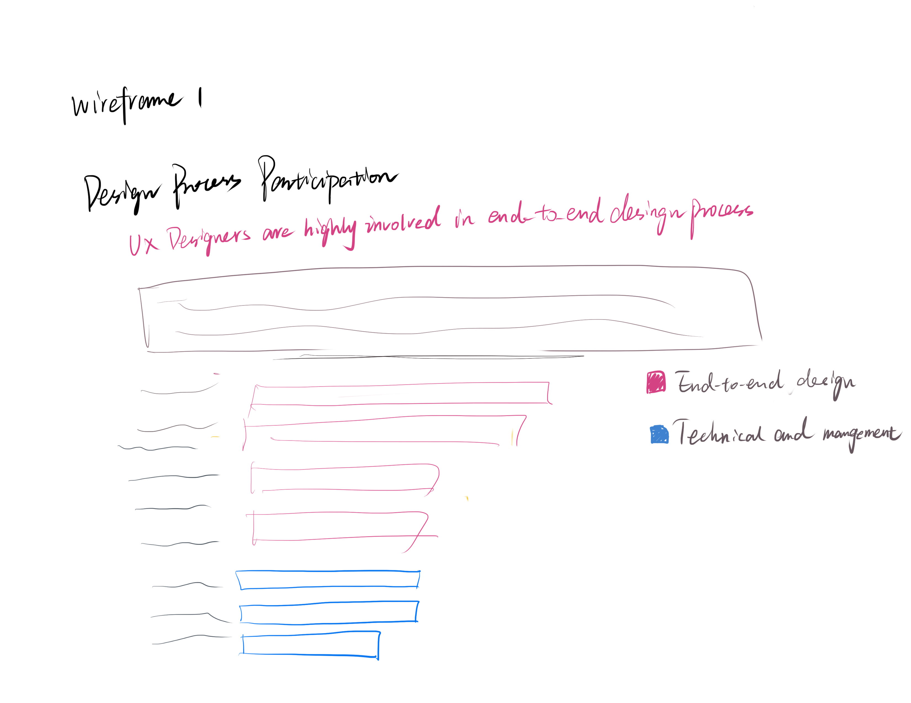
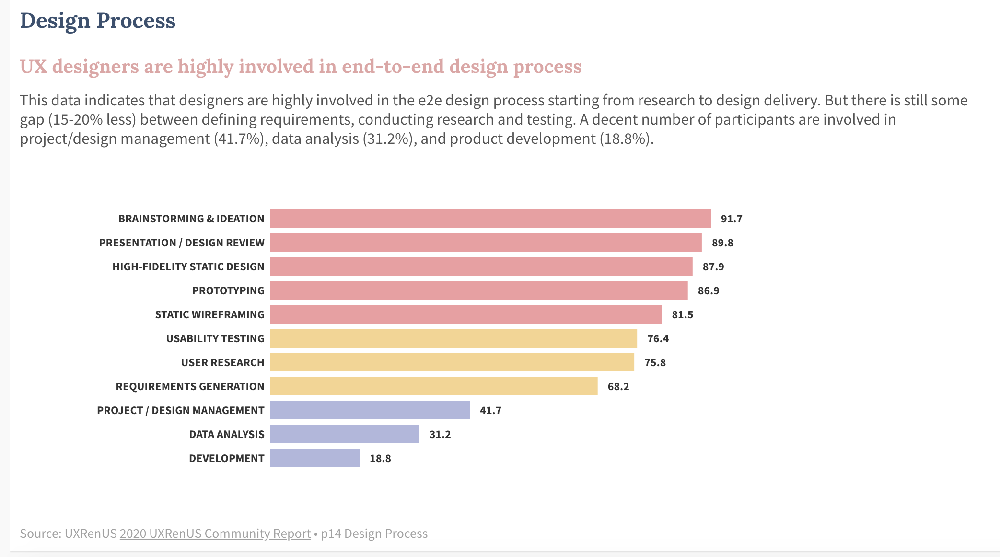
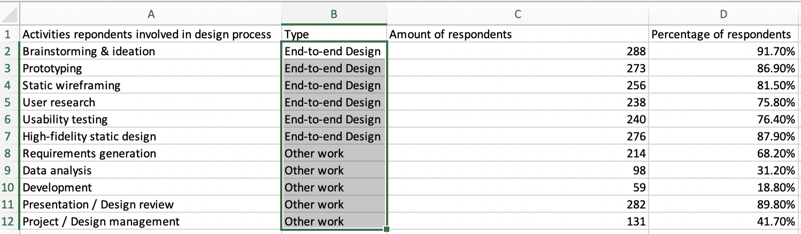

# Assignment 3 and 4

## Step 1: Pick a data visualization
Design Process chart from the 2020 UXRenUS Community Report
[report link](https://uxdesignjob.files.wordpress.com/2020/03/uxrenus_report_2020-4.pdf)

The reason why I choose this:
I picked this chart because it is very insightful for beginning UX designers to learn about industrial working activities, but it includes plenty of information and realy needs people to have domain-specific knowledge to understand it.

## Step 2: Chart critique
### Here I use the Data Visualization Effectiveness Profile
* **Usefulness** : 9   
Reason: 
The chart provides insightful information to viewers about design activities that ux-related people engage in.

* **Completeness** : 5  
Reason: 
This chart not only contains the statistics but also hides some domain-specific information including "what activities does end-to-end (e2e) design process contain", "what are not". Thus, it's rather completed.
However, the author didn't give a sufficient description and summary for this chart, which makes it falls into a lot of confusion. It's difficult for viewers to identify the author's central idea.

* **Perceptibility** : 4  
Reason: 
The bars in this chart are in a mess, and the color usage didn't make a lot of sense. For primary viewers: people in UXRen community, they can understand it after processing and re-organizing the information, but for secondary viewers:
it would be difficult for them to understand the chart.
* **Truthfulness** : 10  
Reason: 
The report author has mentioned the data source. Besides, the contents in this chart have clear title, subtitle and description section, which looks professional and trustful.

* **Intuitiveness** : 4  
Reason: 
The chart is not intuitive due to the unordered bars and un-organized colors. For the percentage in this chart, it's not 100% in total, but each of the bar represents an individual percentage value. This distinguish needs people some time to realize.

* **Aesthetics** : 6  
Reason: 
The colors use in the text parts are clear. The layout and typography are good.

* **Engagement** : 8  
Reason: 
This chart is like an overview of a ux designer's working routine. It can call audience's personal experience as well as leading them to learn more about the topic.

**Observations**  
The explanation on the right-hand side gives me clear concept under the topic. This chart tells me about the necessary skills as an ux designers.
What worked well?
* The author chose to use a horizontally-aligned bar chart, which makes the labels on y-axis easy to read.
* numbers and percentage are clearly displayed on the right-hand side
* The one-sentence statement under the title really catches my eyes. It shows the author's attitude and provides viewers a brief introduction.
What will I do?
The bar chart has it's cons:
* colors that are used to categorize the activities don't work well
* The analysis, title and data doesn't echo each other.
* The chart need a focus point.

I would like to re-order the bars according to the statement and descriptions. Then, unify the bars with a single color, and just highlight the important ones.

## Step 3: Wireframe
### Version 1

In this version I ranked the data by percentage, and suprisingly find out that the activities in the same category are clustered. Therefore, I split the activities into three types: ux design, ux research, and technical and mangement work.

**Testing with people:** 
* audience 1: junior ux designer 
The chart is good, but too much information are presented at the same time. She hopes to see separate charts and each one only used for one single purpose.
 Besides, she doesn't understand what's the relationship between "End-to-end design" on the title and the data in this chart, since there's no corresponding words or description about them.
  This let me realize that I need to keep the terms consistent. Therefore I decide not to combine ux design and ux research into one category: **End-to-end design**
 
 ### Version 2
 
 
 * audience 2: student whose major little related to ux design
 From the title, she assumes that the chart is telling her about the importance of e2e design, but in the chart, she is confused by so many activities. Since she is not familar with the activities of design process, she failed to match the activities with categories.
 Besides, she tells me that there's lack of highlighted information in the text part as well as the corresponding relationship. She cannot find the bars that text has talked about. 
 
 Given by her feedback, I realize that there's still a gap between novice and professionals when viewing this chart. Also, I re-read the title to interpret it.
 1. design activities takes a large proportion than product mangement and techinical implementation  ("designers are highly involved in the e2e design process starting from research to design delivery ")
 2. inside the e2e design process, participation of research activities are less than ui&ux design activities  ("But there is still some gap (15-20% less) between defining requirements, conducting research and testing. ")
 3. the participation of technical and management work is not that rare. 
  ("A decent number of participants are involved in project/design management (41.7%), data analysis (31.2%), and product development (18.8%).")
 These three purpose can be fullfilled by two charts. One for a comparison of participation rate between two categories: e2e design, other work. Another chart to highlight the gap between ux design and ux research inside the e2e design process.
 However, the 3rd point here seems not applicable. "Decent" is hard to define without a comparison of previous data.
 
 ### Version 3
 a new column is added
  
  

 
 
